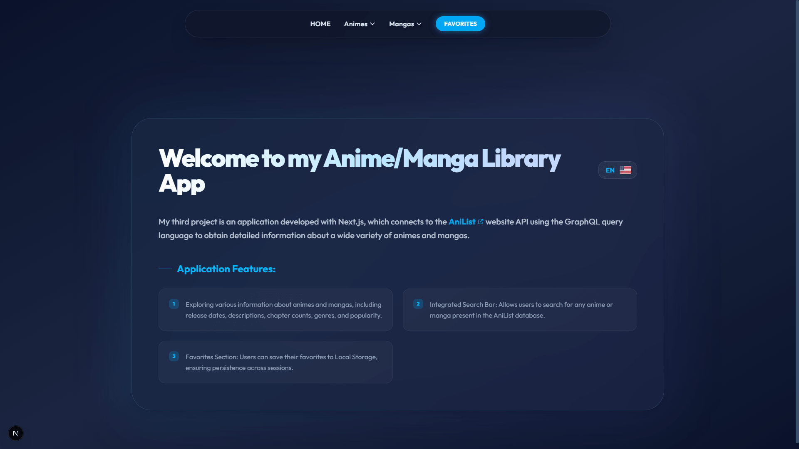
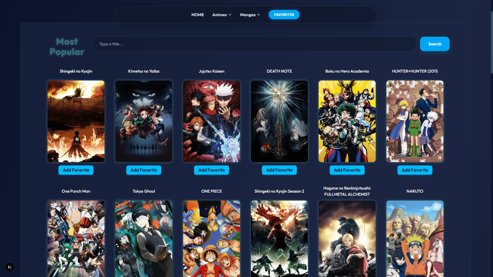
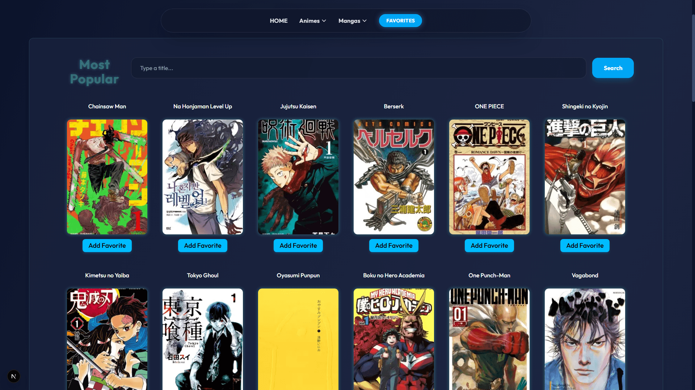
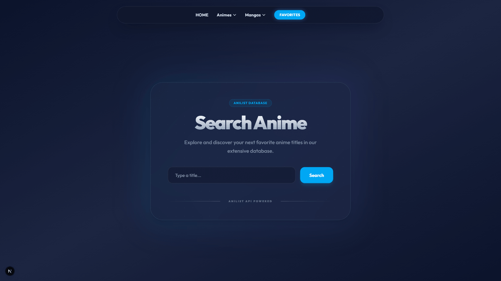
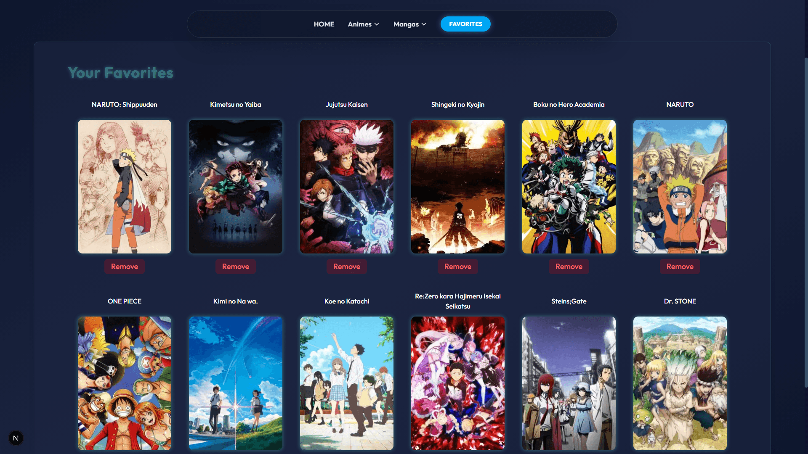

## PROYECTO 3  - NEXTJS ANIME AND MANGA DATABASE 
  

  ## English

My third project is an application developed with Next.js, which connects to the AniList website API ("https://anilist.co/home") using the GraphQL query language to obtain detailed information about a wide variety of animes and mangas stored in its database.

Features of the application:

• Exploring various information about animes and mangas available in the API database, including release dates, descriptions, chapter counts, genres, popularity, as well as specific details about each character.

• Integrated Search Bar: Allows users to search for any anime or manga present in the AniList database.

• Favorites Section: Users can add their favorite anime or manga to a favorites section. These favorites are stored in Local Storage, which guarantees that the information persists even if the user temporarily leaves the page, thus facilitating access to their preferred content on future visits.  

## ESPAÑOL

Mi tercer proyecto es una aplicación desarrollada con Next.js, la cual se conecta a la API del sitio web AniList ("https://anilist.co/home") utilizando el lenguaje de consultas GraphQL para obtener información detallada sobre una amplia variedad de animes y mangas almacenados en su base de datos.  

Funcionalidades destacadas de la aplicación:  

• Exploración de información diversa sobre animes y mangas disponibles en la base de datos de la API, incluyendo fechas de estreno, descripciones, recuento de capítulos, géneros, popularidad, así como detalles específicos sobre cada personaje.  

• Barra de búsqueda integrada: Permite a los usuarios buscar cualquier anime o manga presente en la base de datos de AniList.  

• Sección de Favoritos: Los usuarios pueden agregar sus animes o mangas preferidos a una sección de favoritos. Estos favoritos se almacenan en el Local Storage, lo que garantiza que la información persista incluso si el usuario abandona temporalmente la página, facilitando así el acceso a sus contenidos preferidos en futuras visitas.  

## SCREENSHOTS

HOME PAGE:

ANIMES VIEW:

MANGAS VIEW:

SEARCH ANIMES:

FAVORITES PAGE:

